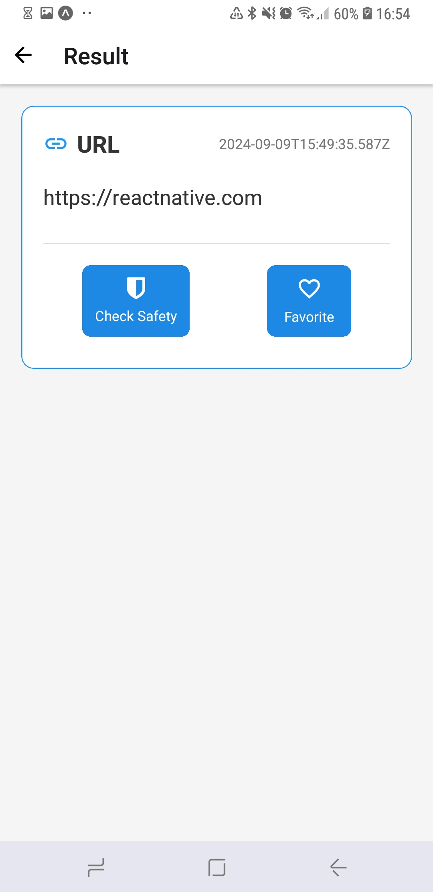

# Conception UX

## Wireframes et Mockups

### Écran de Scan

Interface pour scanner les QR codes avec options pour activer la torche, changer de caméra, etc.

### Écran de Résultats

Affichage des résultats du scan avec les informations extraites et la vérification de sécurité.

### Écran d'Historique

Liste des scans précédents avec options pour voir les détails.

### Écran de Favoris

Liste des scans marqués comme favoris.

### Écran de Paramètres

Options pour modifier les paramètres de l'application.

### Écran d'Authentification Biométrique

Interface pour l'authentification par empreinte digitale.